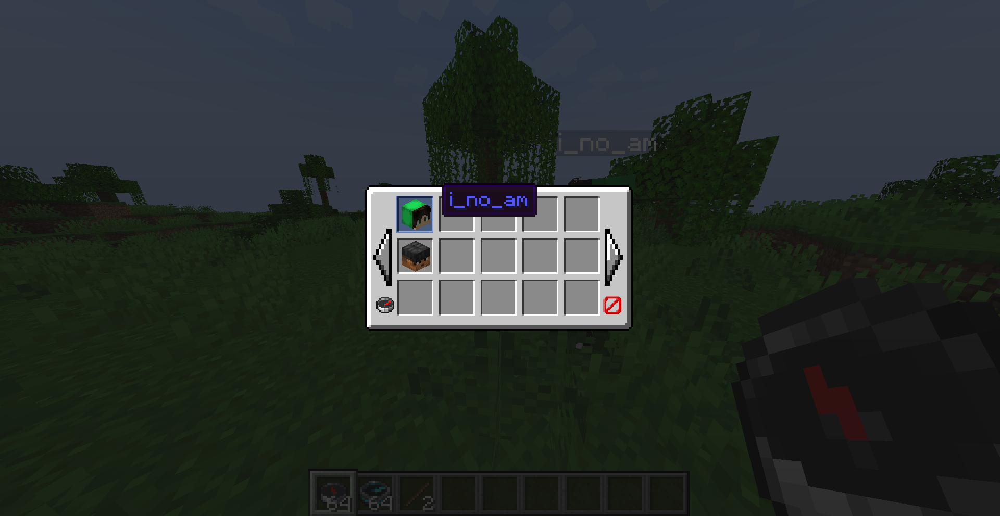
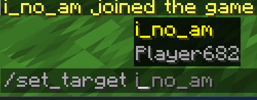
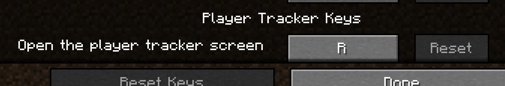

# Player Tracker Mod by UHB217
-----------------
```yml
How to use?
# Install the latest version.
# Press the keybind R on your keyboard to open the GUI.
# Choose the player that you want to follow.
# Hold the compass and if the player is within your render distance it will show you the target player direction.
```
--------------------
## Showcase:
### GUI

### COMMAND

----------
### Setting The Keybind

--------------------
### In Game Example:

-----------------

**BE AWARE THAT YOU CAN ALSO USE THE COMMAND AS SHOWN**

------------------
**tysm for using this mod** 🙏